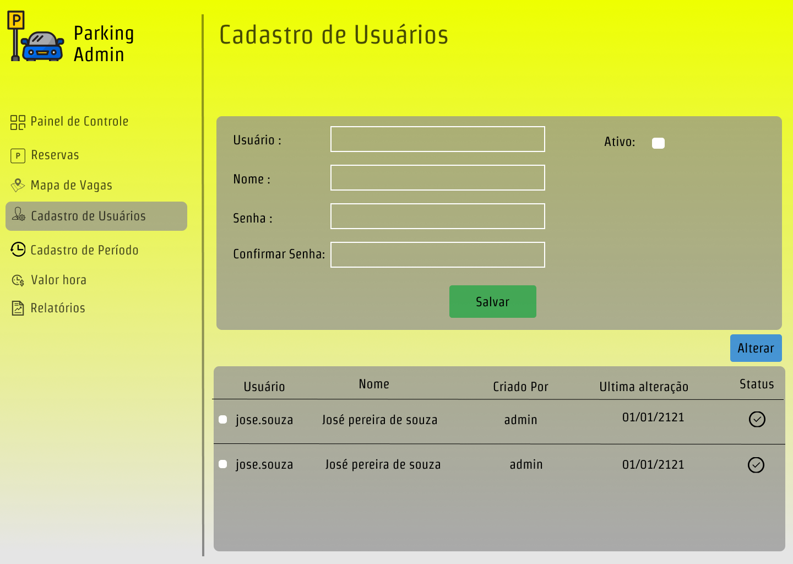

# Projeto de Interface

Pré-requisitos: <a href="2-Especificação do Projeto.md"> Documentação de Especificação</a>

O usuário por meio de um menu lateral simples poderá navegar entre as diversas telas do sistema.

Por ser um aplicativo que tem como intuito a gerência de um estacionamento foi priorizado a fácil interação com técnicas UX/UI e design amigável. 

## User Flow

## WireFrames

Tela de login que terá opções de preenchimento de usuário e senha por parte do usuário.

O painel de controle será atualizado sempre que houve entrada e saida de veículos.

A tela de reserva mostra uma listagem e o status de cada veículo.

O mapa de vagas mostra a disposição das vagas do estacionamento. 

tela para cadastrar os usuários do sistema.

Tela para cadastrar os períodos.

Tela para registrar a entrada e saida de veículos.

Tela para registrar o valor hora para cada cliente.

